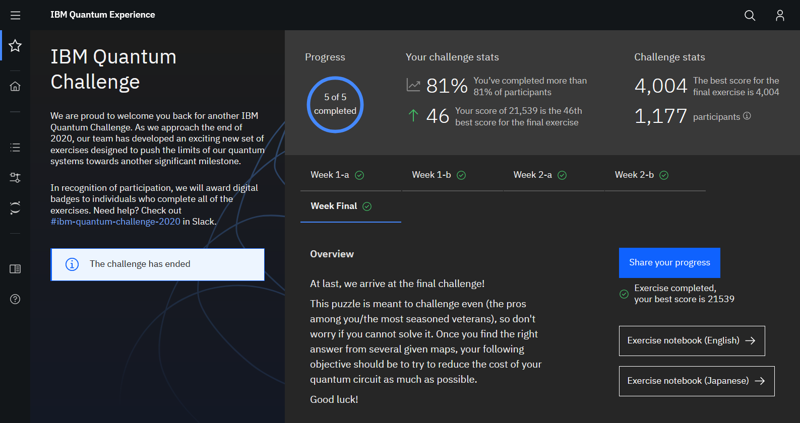

# IBM Quantum Challenge - Fall 2020  

These are the solutions I submitted for the [IBM Quantum Challenge - Fall 2020](https://quantum-computing.ibm.com/challenges)    
The original repo with all the materials and official solutions can be found [here](https://github.com/qiskit-community/IBMQuantumChallenge2020)  

## Summer School Details  
__Site:__ [IBM Quantum Experience](https://quantum-computing.ibm.com/challenges)  
__Date:__ November 2020  

## Certificate  
Badges are expected to be issued in Jan 2021.  

  
For now, here's a screenshot with my tentative ranking for the final challenge.  

## Description  
The solutions are coded in `exXX_en.ipynb` in the `exercises` folder. Each also has html copies for easier reference.  
The `ipynb` are all self-contained, with explanations, problem statements and the exercise portion at the end.  
There are also completed mini-puzzles in `quizzes`, and the hints you get after completing them in `hints`.  

## Topics  
`ex1a` - Full Adder  
`ex1b` - Grover's Algorithm | Basics  
`ex2a` - Grover's Algorithm | Implementation  
`ex2b` - Grover's Algorithm | QRAM & Larger Search Spaces  
`final` - Grover's Algorithm | Choosing Oracles  