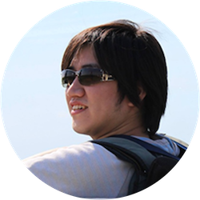
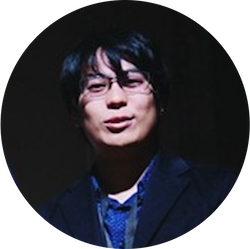
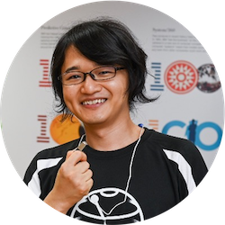
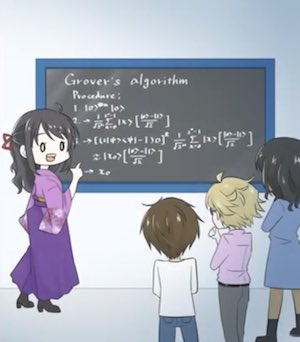

# Final Exercise Leaderboard
 
 ## Congratulations to the winners and top scorers!

Thank you to everyone who submitted their code to the final challenge! 
The following shows the top ten scorers who submitted their code to the final challenge (Nov 30, 2020 13:00 JST)  

### Top Ten Scorers
*(Note: All top scorers submissions have been verified by judges and scores are finalized. Their decision will be final and no further discussions will be held.)*

| Ranking  | Name  | Score |
| ---     | ---    | --- | 
| 1     | Hironari Nagayoshi    | 4004 |
| 2     | Adam Szady    | 4819 | 
| 3     | Pulkit Sinha    | 5124 |  --- |
| 4     | Witold Jarnicki    | 6065 |  --- |
| 5     | Lukas Burgholzer    | 6552 |  --- |
| 6     | Jan Tulowiecki    | 6574 |  --- |
| 7     | Guillermo Alonso    | 7799 |  --- |
| 8     | Stefan Hillmich    | 8188 |  --- |
| 9     | Joel Sunil      | 8864 |  --- |
| 10     | Chris Chen   | 9127 |  --- |

## Judges 
The following members served as judges for the challenge. They were the core members who created the exercises for our IBM Quantum Challenge Fall 2020.  

  
**Dr. Takahiko Satoh**  
**Project Assistant Professor, Keio Quantum Computing Center**  

  
**Shin Nishio**  
**Research Assistant, National Institute of Informatics/SOKENDAI**  

  
**Atsushi Matsuo**  
**Researcher, IBM Quantum**  

## How we determined the score
Scores were determined by measuring the circuit implementation cost to solve the final exercise.  
Cost is defined as: Cost = *S* + 10*C*  where *S* is the number of single-qubit gates and *C* is the number of CNOT (CX) gates.    Any given quantum circuit can be decomposed into single-qubit gates and two-qubit gates.    With the current Noisy Intermediate-Scale Quantum (NISQ) devices, CNOT error rates are generally ten times higher than a single qubit gate.Therefore, we weigh CNOT gates ten times more than a single-qubit gate for evaluating the circuit implementation cost.   
The lower the cost, the better.

--------------------------------
# Participants who completed the final exercise

## Congratulations to all who completed the final exercise!

*(Listed in alphabetical order)*  
Kusal Mahendra	Abeywickrama, 
Mitesh	Adake, 
Chulwoo	Ahn, 
Riccardo	Aiudi, 
Ibrahim	Almosallam, 
Guillermo	Alonso, 
Md Sajid	Anis, 
Riya	Arora, 
Kaito	Asai, 
Hiroki	Asakawa, 
Mostafa	Atallah, 
Diego	Athayde Monteiro, 
Bao	Bach, 
Vishal	Bajpe, 
Armando	Bellante, 
Juan Bernardo	Benavides Rubio, 
Naphan	Benchasattabuse, 
Amandeep	Bhatia, 
Gary	Bilkus, 
Subhadeep	Biswas, 
Sorin	Bolos, 
Luigi	Bonati, 
Aditya 	Bothra, 
Sebastian	Brandhofer, 
Lukas	Burgholzer, 
Fabiola	Cañete Leyva, 
Ivan	Carvalho, 
Carlo	Cascio, 
Mantas	Cepulkovskis, 
Sanivarapu Sarath Chandra Reddy, 
Adarsh	Chandrashekar, 
Chris (Jielun)	Chen, 
Man Hin	Cheng,
Manav	Chhibber,
Wei-Chen	Chien,
Yujin	Cho,
Peter	Cogill,
Adrian	Copetudo Espinosa,
Franklin	de Lima Marquezino,
Pascal	Debus,
Indranil	Dey,
Sagar	Dollin,
Patrick	Downing,
Nico	Einsidler,
Paul	Faehrmann,
Fabrizio	Finozzi,
Khurshed	Fitter,
Aboulkhair	Foda,
Guillermo Andrés	Fonseca Kuvacic,
Pablo	Formoso Estrada,
Shion	Fukuzawa,
Sri Ram Kailash 	G,
Subrahmanyam 	Gantasala,
Tanya	Garg,
Bahman	Ghandchi,
Elies	Gil-Fuster,
Bhaavan	Goel,
Wittmann	Goh,
Dhruv	Gopalakrishnan,
Nancy	Goyal,
Saumya	Goyal,
Anne-Lise	Guilmin,
Manvi	Gusain,
Moritz	Gutt,
Ramy 	Harib, 
Ruofan	He,
Stefan	Hillmich,
Marcel	Hinsche,
Tom	Holden-Dye,
Calum	Holker,
Meng	Hua,
Shadab	Hussain,
Yuki	Ito,
Dustin	Jacqmin,
Ammar	Jahin,
Vipul	Jain,
Vaibhav	Jain,
Babita 	Jajodia,
Witold	Jarnicki,
Praveen	Jayakumar,
Siyu	Jian,
Kiran	Johns,
Saasha 	Joshi,
Akshay	Kale,
Sumit Suresh	Kale,
Sampreet	Kalita,
Shruti	Kalkar,
Eyal	Kalman,
Yusuke	Kanamori,
Marius	Kavaliauskas,
Akito	Kawasaki,
Josh	Kelso,
Nikhil	Keshav,
Ufuk	Keskin,
Dongsin	Kim,
Gyeonghun	Kim,
Hoyoung	Kim,
Saesun	Kim,
Hiraku	Koduma,
Yuki	Koizumi,
Eileen	Kuehn,
Hideto	Kumakura,
Jitesh	Lalwani,
Denisa	Lampášová,
Samantha	Lang,
Elbert Timothy	Lasiman,
I-KWAN	Lee,
Xinwei	Lee,
Polina	Levyant,
Tai Yue	Li,
Zhengze	Li,
Billy	Lim Jun Ming,
Deep	Lokhande,
Shufan	Lu,
Taoyuze	Lv,
Chien-Kai	Ma,
Onkar	Madli,
Danyal	Maheshwari,
Ritajit	Majumdar,
Jyot	Makadiya,
Alberto	Maldonado Romo,
Andres Camilo	Marulanda Bran,
Sergi	Masot Llima,
Alena	Mastiukova,
Anuj	Mehrotra,
Kou	Misaki,
Abhigyan	Mishra,
Abhijit	Mitra,
Naoki	Mitsui,
Shah	Mohtashim,
Sukrut	Mondkar,
Masato	Mouri,
Tristan	Müller,
Eraraya Ricardo	Muten,
Keerthiraj	Nagaraj,
Hironari	Nagayoshi,
Soshun	Naito,
Yuya	Nakagawa,
Yudai	Nakakubo,
Shota	Nakasuji,
Rafael	Nepomechie,
Ana	Nikolic,
Keith	O'Donnell, 
Ryunosuke	Okubo,
Kosuke	Onishi,
Tamiya	Onodera,
Renganathan	Palanisamy,
Joachim	Paret,
Eunju	Park,
Carlos	Pegueros,
Huba	Péter,
Dario	Petrillo,
Kamen	Petroff,
Jakub	Pilch,
Krishanu	Podder,
Rohit	Prasad,
Florian	Preis,
Ziwei	Qiu,
Mohammed Aamir	Qudsi,
Khushwanth Kumar	Ragam,
Suryaprasath 	Ramalingam,
Ricardo	Ramirez,
Kenyi Josué	Ramírez Palacios,
Chang	Ran-Yu,
Michael	Rollin,
Gonzalo	Rubio Martínez,
Lewis 	Ruks,
Hyunwoo	Ryu,
Nahum	Sá,
Saptarshi	Sahoo,
Najla	Said,
Freddie	Samy,
Hirmay	Sandesara,
Radha Pyari	Sandhir,
Andy	Saporito,
Hayk	Sargsyan,
Md. Sakibul Islam	Sazzad,
John	Schneider,
Pinaki	Sen,
Jayath	Seneviratne,
Diego Emilio	Serrano,
Vadim	Shabashov,
Farida	Shagieva,
Soyoung	Shin,
Shashwat 	Shukla,
Daniel	Sierra-Sosa,
Divyanshu	Singh,
Prakhar	Singh,
Rishabh	Singhal,
Pulkit	Sinha,
Satzhan	Sitmukhambetov,
Kouhei	Souji,
Adrien	Suau,
Gary	Sung,
Jirayu	Supasil,
Adam	Szady,
Muhammed Jabir 	T,
Shokichi	Takakura,
Nobuhiko	Tamura,
Ritu	Thombre,
Miroslav	Tomasik,
Andrei Voicu	Tomut,
Tony	Tong,
Duc	Tran,
Georgios	Tsilimigkounakis,
Satoyuki	Tsukano,
Jan	Tułowiecki,
Hironori	Uchikawa,
Arthi	Udayakumar,
Abhirami	V S,
Natan	Vander Meeren,
Chetan	Vardhan,
Sanjay	Vishwakarma,
Alexander	Vlasov,
Ryo	Wakizaka,
Joshua	Wang,
Anosh	Wasker,
Ming-Tso	Wei,
Christof	Wendenius,
Weichen	Xie,
Hiroyuki	Yamada,
Yuya	Yoshimura,
Zhenhua	Zhang,
Zhiyong	Zhang  
 
